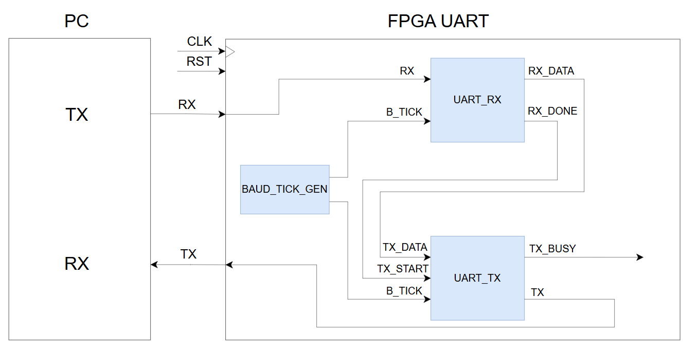
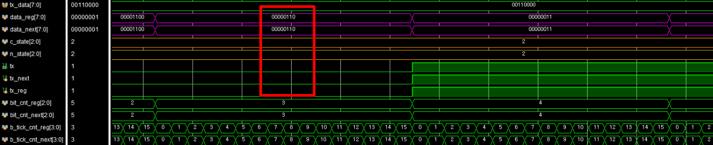
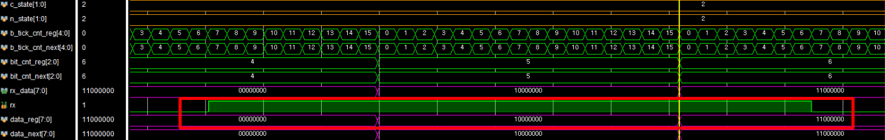
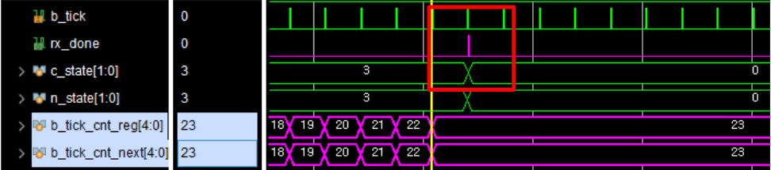
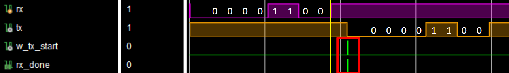
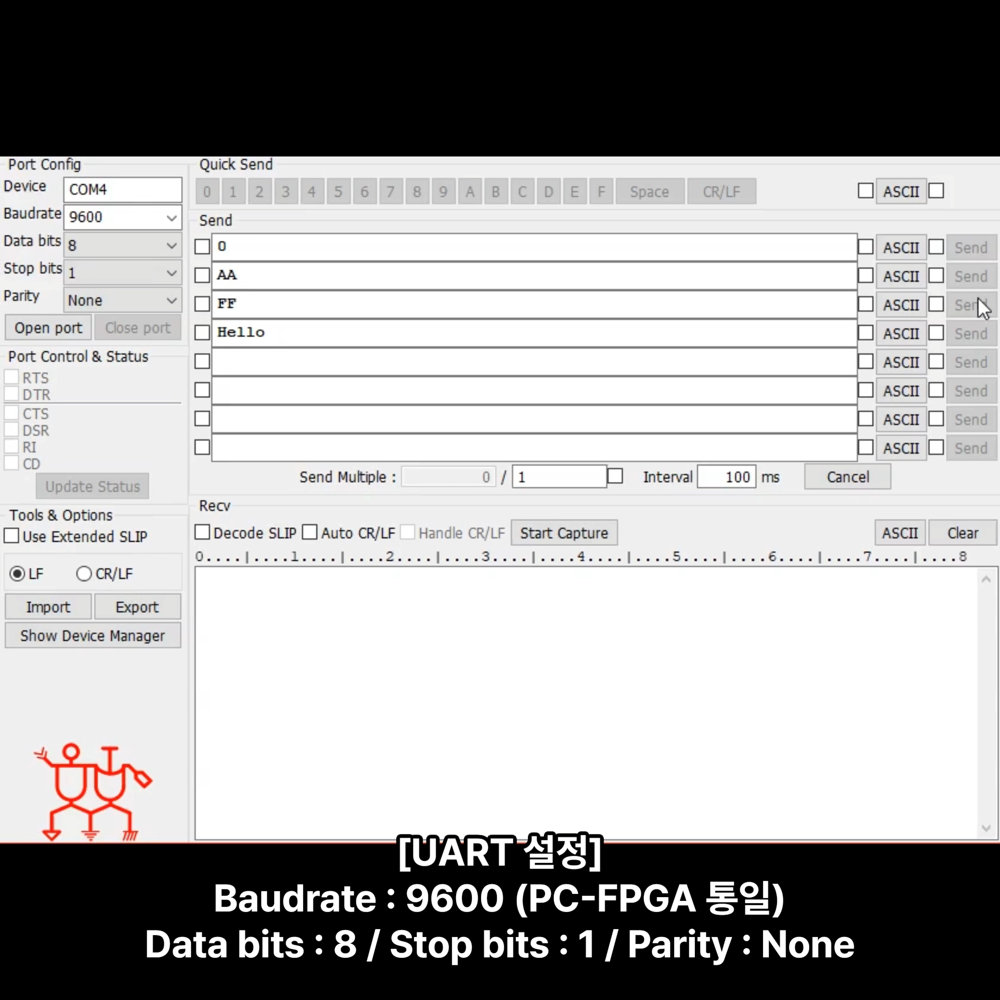

# UART Loopback (FPGA, Verilog)

Basys3 FPGA 보드에서 UART TX와 RX를 직접 설계하고 Loopback으로 연결한 프로젝트입니다. PC에서 보낸 데이터를 RX가 수신하면 rx_done 신호가 TX를 바로 시작시키고, 수신한 8bit 데이터를 다시 PC로 전송합니다.

- 개발 기간: 2026.04.23 ~ 2026.04.27
- 개발 환경: Xilinx Vivado 2020.2, Vivado Simulator
- 설계 언어: Verilog HDL
- FPGA Board: Digilent Basys3
- 입력 클럭: 100 MHz
- 시리얼 터미널: Comportmaster

## UART 설정

- Baud Rate: 9600 bps
- Frame: 8-N-1
- Data: 8bit
- Parity: None
- Stop Bit: 1bit
- Bit Order: LSB first
- RX Sampling: 16x Oversampling

## 동작 구조

PC에서 들어온 비동기 RX 신호는 2단계 Synchronizer를 거쳐 내부 클럭에 동기화됩니다. UART RX는 Start Bit를 검출한 뒤 각 비트의 중앙에서 데이터를 샘플링해 8bit 병렬 데이터로 복원합니다.

수신이 끝나면 rx_done이 1클럭 동안 발생합니다. 이 신호를 TX의 tx_start에 연결하고, rx_data를 tx_data로 전달해 같은 데이터를 바로 재전송하도록 구성했습니다.

  

## 구현 내용

### Baud Tick 생성

100 MHz 시스템 클럭에서 9600 bps의 16배인 153.6 kHz Sampling Tick을 생성합니다. 현재 코드에서는 분주값을 651로 사용하며, TX와 RX가 같은 b_tick을 기준으로 동작합니다.

### UART TX

- IDLE, START, DATA, STOP의 4개 state로 구성
- tx_start 입력 시 8bit 병렬 데이터를 내부 레지스터에 저장
- Start Bit, 8 Data Bits, Stop Bit 순서로 출력
- DATA state에서 LSB부터 1bit씩 전송
- 전송 중에는 tx_busy를 1로 유지

### UART RX

- IDLE, START, DATA, STOP의 4개 state로 구성
- 동기화된 RX 신호에서 Start Bit 검출
- Start Bit 중앙까지 8번의 b_tick을 기다린 뒤 수신 시작
- 이후 16번의 b_tick마다 Data Bit를 샘플링
- 8bit 수신이 끝나면 rx_data를 갱신하고 rx_done을 1클럭 동안 출력

### 2단계 Synchronizer

PC에서 들어오는 RX는 FPGA 내부 클럭과 동기화되지 않은 신호입니다. rx 신호를 rx_syn1과 rx_syn2 두 단계로 전달한 뒤 rx_syn2를 UART RX에서 사용하도록 구성했습니다.

### Loopback 연결

uart_loopback 모듈에서 rx_done을 tx_start에, rx_data를 tx_data에 연결했습니다. 별도의 소프트웨어 처리 없이 FPGA 내부에서 수신 데이터를 그대로 다시 전송합니다.

## 설계하면서 수정한 내용

### RX STOP 구간 대기 시간

RX는 각 비트의 중앙을 기준으로 샘플링하기 때문에 마지막 Data Bit를 읽은 시점과 실제 Stop Bit가 끝나는 시점 사이에 차이가 생겼습니다. STOP state에서 b_tick_cnt가 23이 될 때까지 기다리도록 변경해 RX 신호가 안정된 뒤 IDLE로 돌아가도록 했습니다.

### 비동기 RX 신호 처리

외부 RX 신호를 바로 사용하지 않고 2단계 Synchronizer를 추가했습니다. 내부 로직은 두 번째 Flip-Flop을 통과한 rx_syn2만 사용하도록 연결했습니다.

## 시뮬레이션 및 FPGA 확인

### TX Data 전송

DATA state에서 tx_data가 LSB부터 순서대로 출력되고, 각 비트가 16번의 b_tick 동안 유지되는 것을 확인했습니다.

  

### RX Synchronizer

rx 신호가 rx_syn1과 rx_syn2를 거치면서 각각 1클럭씩 지연되는 것을 확인했습니다.

  

### RX 완료 신호

8bit 수신과 STOP 구간이 끝난 뒤 rx_done이 1클럭 동안 발생하고 IDLE로 돌아가는 것을 확인했습니다.

  

### Loopback 동작

입력 데이터 8'h30을 수신한 뒤 rx_done이 TX를 시작시키고, 같은 비트 패턴이 tx로 다시 출력되는 것을 확인했습니다.

  

### Comportmaster 설정

Basys3와 PC를 연결하고 Comportmaster를 9600 bps, 8 Data Bits, No Parity, 1 Stop Bit로 설정해 전송한 데이터가 그대로 돌아오는 것을 확인했습니다.

  

## 파일 구성

### RTL

- uart_loopback.v: 최상위 모듈과 Loopback 연결
- uart.v: UART TX, Baud Tick Generator 및 TX/RX 통합
- uart_rx.v: UART RX, 16x Oversampling 및 2단계 Synchronizer
- button_debounce.v: 버튼 입력용 Debounce 모듈이며 현재 Loopback Top에는 연결하지 않음

### 문서 및 이미지

- assets: 시스템 구조도, 시뮬레이션 파형, UART 설정 화면
- docs/final-report.pdf: 프로젝트 완료보고서
- docs/presentation.pptx: 최종 발표자료
- docs/schedule.xlsx: 프로젝트 일정표
- docs/development-logs: 날짜별 개발일지

## Vivado 실행 방법

1. Vivado 2020.2에서 RTL Project를 생성합니다.
2. rtl 폴더의 Verilog 파일 4개를 Design Sources에 추가합니다.
3. uart_loopback을 Top Module로 설정합니다.
4. Basys3의 Clock, Reset, UART RX, UART TX 핀에 맞는 XDC Constraint를 추가합니다.
5. Synthesis, Implementation, Bitstream Generation 순서로 진행합니다.
6. Basys3에 Programming한 뒤 Comportmaster를 9600-8-N-1로 설정해 확인합니다.

현재 저장소에는 XDC Constraint와 Testbench 원본이 포함되어 있지 않습니다.

## 추가 예정

- Basys3 XDC Constraint와 Testbench 추가
- Start Bit 중앙 재확인 로직 추가
- Baud Rate 분주값 Parameter화
- Parity와 Framing Error 검출 기능 추가
- 연속 데이터 처리를 위한 FIFO 연결

